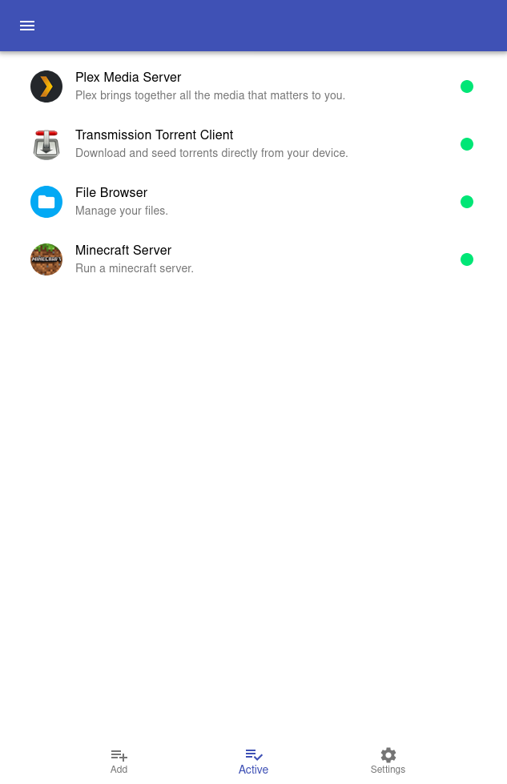
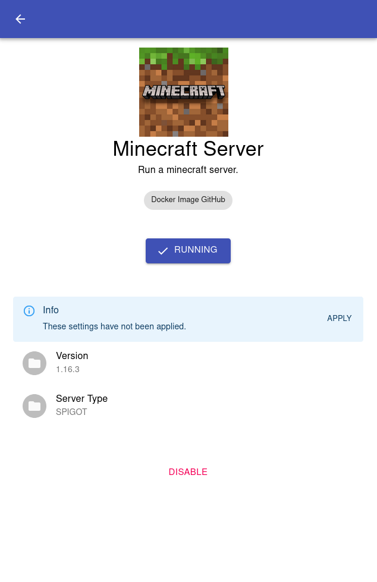
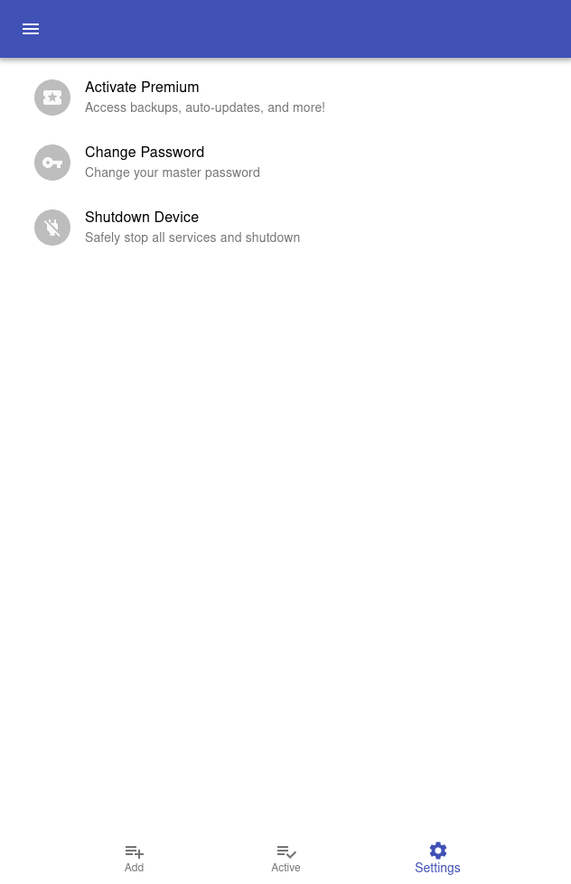

The easiest way to own your cloud. Your data. Your cloud. Rainstorm.

## Getting Started

Head over to our downloads page to download an image for your device.
Alternatively, you can install on your own device (see Build Instructions)

## Overview

Rainstorm aims to be the easiest way to to run a dedicated, easy to use,
home server leveraging many popular and open source cloud alternatives that give you complete ownership and control of your data.

With the increasing power and affordability of small board computers like the Raspberry Pi, we believe its finally feasible for everyone to own their cloud instead of giving everything they own to the cloud.

By running Rainstorm, you can quickly and cheaply deploy your own cloud infrastructure all from the web browser with ZERO terminal commands necessary.

## Features

Each installation of Rainstorm enables a number of wonderful features.

- Nextcloud
- Plex (Media Server)
- Transmission (Torrent Client)

In the future, we'd also like to have...

- VPN
- Tor Relay
- Minecraft Spigot/Bukkit server
- Jitsi Server
- RocketChat/Mattermost chat server
- Email server
- Data backup solutions (possibly using a public cloud like Tardigrade)

- ...and many more features!

## Screenshots

|            Home Screen            |             Service View              |             Device Settings             |
| :-------------------------------: | :-----------------------------------: | :-------------------------------------: |
|  |  |  |

## Supported Devices

- Raspberry Pi 4

## Running Rainstorm

You can run Rainstorm on your own device in just a few easy steps!

1. Download an image from our downloads page.

2. Flash image onto SD card

- Download [Etcher](https://www.balena.io/etcher/)
- Flash downloaded image

3. Insert SD card and attach external HD (highly recommended) to device

4. Boot your device and visit http://rainstorm.local or http://ip_of_device/

## Build Instructions

You can also run Rainstorm on your own to modify, and update the software yourself.

`sudo su -`

`git clone https://github.com/project-rainstorm/project_rainstorm.git`

**WARNING** Running this script will make changes to your system. This is meant to be run on a dedicated device with a freshly installed OS (RPi4 running Raspberry Pi OS Lite recommended)

`bash project_rainstorm/scripts/setup.sh`

## Adding a Service

Rainstorm uses docker-compose for services. Pull requests are welcome. Checkout the [Services README.md](services/README.md) for more info on how to create services for Rainstorm.

## Contributing

The contribution workfloe is described in [CONTRIBUTING.md](docs/CONTRIBUTING.md).
